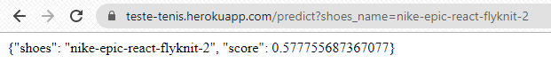
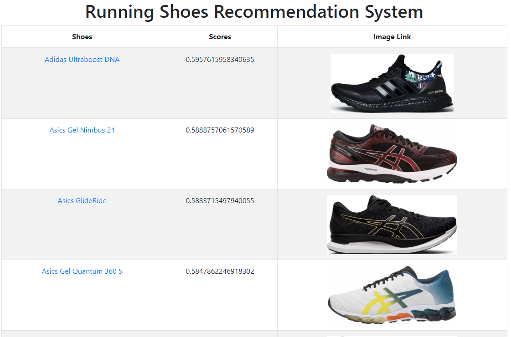

# Como um cientista de dados compra um tênis de corrida?
> [**WebApp - Heroku**](https://como-um-ds-compra-um-tenis.herokuapp.com/)  
> [**Linkedin - Rodrigo Fragoso**](https://www.linkedin.com/in/rodrigo-a-fragoso/)  
> **Email** : rodrigoandradefragoso@gmail.com  

## Resumo

* Em época de quarentena, decidi reservar um pouco do meu tempo para realizar algumas atividades físicas, principalmente de corrida (de forma segura, sempre). Sendo assim, me deparei com o problema de escolher o melhor tênis para comprar, dada a quantidade imensa de opções no mercado.
* Para otimizar minha escolha, criei um *pipeline* completo, desde a formulação do problema até o deploy, para escolher o melhor tênis de corrida, tudo isso baseado em dados. Para isso, passamos por várias etapas: *scraping*, processamento dos dados, modelagem, otimização, até chegar na solução final que foi hospedada no [**heroku**](https://como-um-ds-compra-um-tenis.herokuapp.com/) e me auxiliou bastante a decidir qual produto adquirir.

## Etapas
> Como cheguei nesse WebApp?

1. Formulei o problema e procurei o melhor site, para extrair informações e realizar o meu projeto. A página escolhida foi o <a href="https://runrepeat.com/" target="_blank">RunRepeat Official Website</a>, que possui diversas informações sobre milhares de tênis, além de uma vasta quantidade de reviews feitos por especialistas e membros da sua comunidade;

2. Com o site escolhido, criei um *Web Scraper* dividido em duas etapas: [**o coletor de dados da busca do site**](https://github.com/rofragoso/como-um-cientista-de-dados-compra-um-tenis/blob/master/Extra%C3%A7%C3%A3o%20a%20Modelagem/1.1_coletor_busca_tenis.ipynb), que era responsável por listar todos os tênis da categoria desejada, e o  [**coletor dos dados de cada tênis**](https://github.com/rofragoso/como-um-cientista-de-dados-compra-um-tenis/blob/master/Extra%C3%A7%C3%A3o%20a%20Modelagem/1.2_coleta_de_dados_tenis.ipynb) encontrado. A segunda parte demandou maiores esforços por possuir muitas informações na página;

3. De posse de todos esses dados brutos, realizei o seu [**processamento**](https://github.com/rofragoso/como-um-cientista-de-dados-compra-um-tenis/blob/master/Extra%C3%A7%C3%A3o%20a%20Modelagem/2_feature_engineering.ipynb) para criar um *dataset* consumível para treinar os modelos de machine learning que iria utilizar;

4. Para chegar na modelagem, foi necessário fazer a anotação de alguns exemplos no nosso *dataset* e para realizar isso de forma otimizada, reduzindo tempo e recurso, foi utilizada a metodologia do [***Active Learning***](https://github.com/rofragoso/como-um-cientista-de-dados-compra-um-tenis/blob/master/Extra%C3%A7%C3%A3o%20a%20Modelagem/2_feature_engineering.ipynb), no qual também foram treinados alguns modelos de classificação tendo sua performance avaliada via validação cruzada;

5. Com todos os dados que foram anotados, criei mais dois [**modelos**](colcoarlink), **Random Forest** e **LightGBM**, otimizei os seus hiperparâmetros para realizar um classificação mais precisa, e fundi seus resultados utilizando um *ensemble* entre eles;

6. Por fim, construí um container utilizando o docker e hospedei minha aplicação no [**heroku**](https://como-um-ds-compra-um-tenis.herokuapp.com/), concluindo o projeto.

## APIs
* Para adicionar algumas funcionalidades ao aplicativo, foram adicionadas duas APIs com o intuito de consultar o *score* de qualquer tênis que pertença ao site e outra para mandar um comando que atualiza o banco de dados do app.
   * A primeira, denominada de **predict**   https://como-um-ds-compra-um-tenis.herokuapp.com/predict?shoes_name={nome_do_tenis}, e deve ser preenchida com o nome do tênis de acordo com sua página do RunRepeat. 
   

   
   **Exemplo:** para o https://runrepeat.com/nike-epic-react-flyknit-2, podemos acessar seu score via API por: 
   &emsp;&emsp;&emsp;&emsp;https://como-um-ds-compra-um-tenis.herokuapp.com/predict?shoes_name=nike-epic-react-flyknit-2;
   * A segunda, denominada de **update** é consultada pelo link: https://como-um-ds-compra-um-tenis.herokuapp.com/update?code={senha}&pages={pagina_de_busca}. 
   Nesse caso, podemos escolher quantas páginas de busca serão adicionadas e é necessária uma senha para liberar a atualização, por segurança.

## Repositório
* [**Extração a Modelagem**](https://github.com/rofragoso/como-um-cientista-de-dados-compra-um-tenis/tree/master/Extra%C3%A7%C3%A3o%20a%20Modelagem) : Pasta com todos notebooks utilizados para realizar os passos de extração dos dados até a modelagem.
* [**deploy**](https://github.com/rofragoso/como-um-cientista-de-dados-compra-um-tenis/tree/master/deploy) : Pasta com os arquivos utilizados para criar o container do docker e realizar o deploy no heroku.
## Principais ferramentas utilizadas

* scikit-learn
* scikit-optimize
* pandas
* numpy
* scipy
* regex
* docker
* heroku
* beautifulsoup4
* requests

## Agradecimentos
* Agradecimento especial ao [Mario Filho](https://www.linkedin.com/in/mariofilho/) que criou um curso fenomenal, utilizado de base para boa parte deste projeto, e sempre está criando conteúdo sobre Data Science que venho consumindo e aprendendo diversos tópicos a bastante tempo.
    * [Mario Filho - Canal Youtube](https://www.youtube.com/user/marionefilho)
    * [Curso mencionado](https://curso.mariofilho.com/)
* Ao  [Jonathan Cabreira](https://www.linkedin.com/in/cabreirajm/) por disponibilizar o seu template da página web para o deploy.
